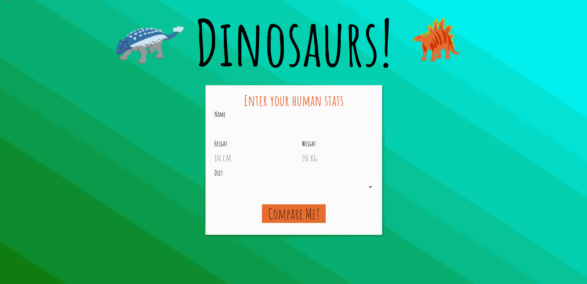

# Dino Infographic 

_Dino Infographic Application in operation

A fun front end web application that compares the human inputted information to the varies dinosaurs. The author developed the interface of the application using HTML and Sass but their main focus of the application was the Javascript logic behind the application. 

It takes advantages of:
- Object Oriented Programming
- Prototypal Interface
- Constructor Functions
- IIFE (Immediatley Invoked Function Expressions)
- The Revealing Module Pattern

The project is designed to be used on a desktop screen. 

## How To Use

To use this web application, that is designed for a desktop experience, follow these steps: 

1. Load the web application
2. Enter the users details, name, height, weight and type of diet. 
3. Click the 'Compare Me!' button to compare yourself to varies dinosaurs
4. Review the results that are displayed on a grid of 3 x 3 cards with the species of the dinosaur, and image of them and a fact.
5. Click the Reset button at the bottom of the page to do a fresh comparsion.

Note: The fact displayed for each dinoasur are choosen at random from 6 available facts: 
- When the dinoasur lived
- Where the dinosaur lived
- An interesting fact related to that dinosaur
- A comparsion of the human and dinosaurs height
- A comparsion of the human and dinosaurs weight
- A comparsion of the human and dinosaurs diet 

This exception to this is the human result card that doesnt display a fact and the pigeon card that always displayed the same fact (as per the project specification).

## How to Install

Taking a copy of the project and running the index.html in the dist folder will allow the user to run the apllication locally. 

The application was developed with webpack. To use develop the application further or to run it on the webpack development server, follow these steps:

- Fork or download the project
- Install all the project dependencies using `npm install`
- To run the project on the development server `npm run start-dev`
- To build the project in the development environment `npm run build-dev`

## Dependencies

This project was developed with:
- npm version 6.14.10
- node version 14.15.4
- All other dependencies are listed in package.json
